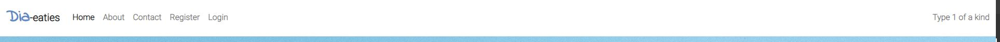
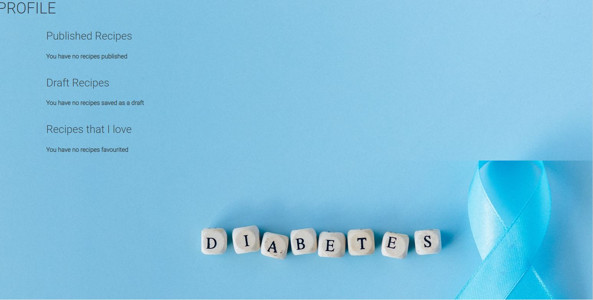
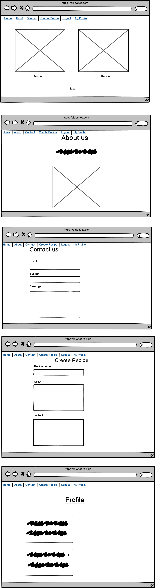
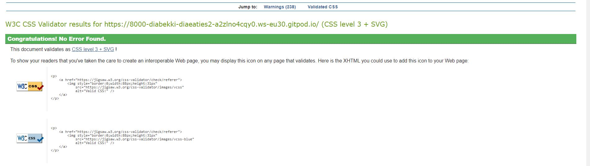
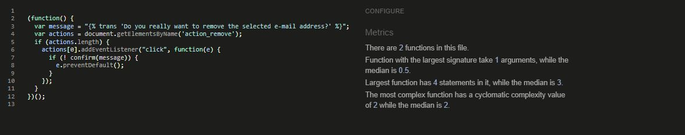

# Dia-Eaties Recipe blog
This project is a recipe blog dedicated to low carb and low sugar meals for diabetics, its very difficult to find suitable recipes for diet requirements in the vast sea of recipes online so I felt this site would be nice to have to have everything compiled into a singular space.
I followed the recipe blog for the project development.

## Features
The blog features a number of interacvitiy for the user, it includes the option to
- register
- login
- logout
- create a recipe for logged in users
- like recipes
- leave comments
- read about page
- {future-feature} Pop ups for diabetic slang

### User Account

- Login signout and registration 

 

### Comments

- Comments section for users to interact

### Create Recipe

- Create a recipe for registered users so users can be part of the webiste experience

### Test recipe

### Like Function

- Like function for recipes 

### Contact us 

- Contact page for users to get in touch with us 

### Navbar
Navbar for user to navigate website

### Footer 
- The the website footer with link to personal github

### About us
- This page gives the user information on what the page is about

### Profile
- This is a profile section whihc has three sections, the published recipes that are visable on the homepage, the draft which is only visable on their profile page and recipes they loved will also display so they can keep track 

### Update/Delete
- Logged in user can delete or update their recipe 

 **Features left to add**

- I would like add more sections to split up the recipes e.g breakfast section, dinner section etc
- I would like to add more resources to organisations that deal with diabetic diets
- Add a more colouful or tasteful section for the ingredients and instructions part of the recipes
- Have pop ups to explain diabetic wording and slang
- There are many things I would like to add in terms of functionality and the overall look

## Program Structure

- This is the original Wireframe for the Dia-Eaties recipe blog

me
- The final result has not changed much lading to the final project 
- The number of recipes has been decreased to two compared to the orginal four 

## Testing

 - I tested the admin approval for comments and recipes
 - I tested the sign in, register and signout process for the user and admin
 - I tested the basic functionality of the page. e.g the responsiveness 
 - I tested the process to allow a registered user to create a recipe and post it to the homepage
 - I tested comment approval within the admin section
 - I tested the profile page
 - I had users to test the website (make their own profile, recipe etc)

### Errors

  - The main error I faced was missing module docsctring and class docstring
  - Another error was the line is too long error which again I could not use line break as it distrupted the code 

### Validator Testing 

- I used PEP8 to validate my python code

- I used https://validator.w3.org/ to validate html

- I used https://jigsaw.w3.org/css-validator/ to validate CSS

- I used https://jshint.com/ to validate Javascript

## Deployment 

- The game was deployed through Heroku 
  - I went on to the Heroku website 
  - Clicked on "Create-New-App"
  - Named my project and stated what region I live in
  - I clicked into settings 
  - Clicked into Deploy 
  - Connected to my GitHub
  - Searched for my project name repository and clicked connect
  - Enabled automatic deploys
  - Clicked "Deploy Branch" 

  The live links to my project are - 
   - https://8000-beige-grasshopper-kkfhy7ez.ws-eu17.gitpod.io/
   - https://diaeatiesblog.herokuapp.com/

## Acknowledgements

I want to thank my Fiance who kept pushing me to keep bettering myself and not letting me give up and for giving me advice on how to get the readme to sound more structured and professional.
Fellow students for letting me vent frustrations when I felt overwhelmed with the work.
Kasia who keeps up our morale and always checks to see if we are doing okay, she keeps us going through all of this. 

